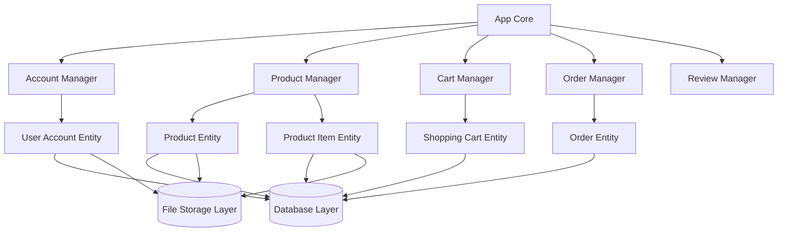

# Architecture Guide

This guide explains the design philosophy and architectural patterns used in S-Commerce. Understanding these concepts will help you use the library effectively and extend it to meet your needs.

## Table of Contents

- [Design Principles](#design-principles)
- [System Components](#system-components)
- [Component Relationships](#component-relationships)
- [Lifecycle Management](#lifecycle-management)
- [Thread Safety Model](#thread-safety-model)
- [Generic Type System](#generic-type-system)

## Design Principles

### Contract-Based Architecture

S-Commerce is built on a foundation of **interfaces** (contracts). Every major component is defined by an interface rather than a concrete implementation. This provides several benefits:

**Flexibility**: You can replace any component with your own implementation as long as it satisfies the contract.

**Testability**: Mock implementations can be easily created for testing.

**Clear Boundaries**: The contract defines exactly what each component does and how it interacts with others.

**Evolution**: Implementations can change without breaking code that depends on the interface.

### Separation of Interface from Implementation

The library separates three distinct layers:

1. **Contract Layer** (`contracts.go`, `db_contracts.go`, `fs_contracts.go`): Pure interface definitions
2. **Implementation Layer** (various files): Concrete implementations prefixed with "Builtin"
3. **Application Layer** (your code): Uses the contracts without knowing the implementation details

This separation means you can:
- Use builtin implementations out of the box
- Replace specific components with custom implementations
- Mix builtin and custom implementations
- Change implementations without changing calling code

### Manager-Entity Pattern

S-Commerce organizes functionality around two types of objects:

**Managers**: Coordinate operations on collections of entities
- Create new entities
- Retrieve entity lists
- Delete entities
- Perform collection-wide operations (search, count)
- Handle lifecycle for their domain

**Entities**: Represent individual domain objects
- Manage their own state
- Provide property access and mutation
- Handle relationships with other entities
- Encapsulate business logic

**Relationship**: Managers create and manage entities. Entities perform operations on themselves.

## System Components

### Core Application (App)

The `App` struct is the central hub of your S-Commerce application. It contains instances of all managers:

**Structure**:
```
App[AccountID]:
  - AccountManager: User account operations
  - OrderManager: Order management
  - PaymentMethodManager: Payment method catalog
  - AddressManager: Address management
  - ShoppingCartManager: Shopping cart operations
  - RoleManager: User role management
  - ProductManager: Product catalog
  - CountryManager: Country reference data
  - PaymentTypeManager: Payment type reference data
  - ShippingMethodManager: Shipping options
  - OrderStatusManager: Order status tracking
  - UserReviewManager: Product reviews
```

**Configuration**: App requires:
- `DB`: Database implementation (DBApplication interface)
- `FileStorage`: File storage implementation (FileStorage interface)
- `OTPCodeLength`: Length of OTP codes (e.g., 6 or 8 digits)
- `OTPTokenLength`: Length of OTP session tokens
- `OTPTTL`: How long OTP codes remain valid (e.g., 2 minutes)

**Creation**: Use `NewBuiltinApplication` with your configuration to create an App instance with all builtin managers.

### Manager Layer

Managers are the primary interface for your application code. Each manager is responsible for a specific domain:

**User Domain**:
- `UserAccountManager`: Account CRUD, authentication, OTP
- `UserAddressManager`: Address collections
- `UserPaymentMethodManager`: Payment method collections
- `UserOrderManager`: Order collections
- `UserRoleManager`: Role catalog
- `UserShoppingCartManager`: Shopping cart collections

**Product Domain**:
- `ProductManager`: Product catalog, categories, search

**Order Domain**:
- `OrderStatusManager`: Order status catalog
- `ShippingMethodManager`: Shipping options catalog

**Payment Domain**:
- `PaymentTypeManager`: Payment type catalog

**Review Domain**:
- `UserReviewManager`: Review management

**Reference Data**:
- `CountryManager`: Country catalog

**Manager Responsibilities**:
1. **Creation**: Managers create new entities (NewAccount, NewProduct, etc.)
2. **Retrieval**: Managers fetch entities by ID or in lists with pagination
3. **Deletion**: Managers remove entities
4. **Search**: Managers provide search and filtering
5. **Lifecycle**: Managers implement Init, Pulse, and Close

### Entity Layer

Entities represent individual domain objects. Each entity implements an interface contract:

**User Entities**:
- `UserAccount`: Individual user account with all properties and relationships
- `UserAddress`: Shipping/billing address
- `UserPaymentMethod`: Payment method details
- `UserOrder`: Order with items, status, delivery
- `UserRole`: User role definition
- `UserShoppingCart`: Shopping cart with items
- `UserShoppingCartItem`: Item in a cart with quantity

**Product Entities**:
- `ProductCategory`: Category in hierarchy
- `Product`: Product with images and description
- `ProductItem`: Specific SKU with price, stock, attributes

**Review Entities**:
- `UserReview`: Product review with rating

**Reference Entities**:
- `Country`: Country definition
- `PaymentType`: Payment type definition
- `ShippingMethod`: Shipping option with price
- `OrderStatus`: Order status definition

**Entity Characteristics**:
1. **State Management**: Entities cache their properties using form objects
2. **Database Interaction**: Entities read/write to database through their DB interface
3. **Thread Safety**: Entities use RWMutex for concurrent access
4. **Lifecycle**: Entities implement Init, Pulse, Close (often no-ops)

### Database Abstraction Layer

The database layer is defined by the `DBApplication` interface, which aggregates all database contracts:

**Structure**:
```
DBApplication:
  - DBUserAccountManager: Account collection operations
  - DBUserAccount: Individual account operations
  - DBUserShoppingCartManager: Cart collection operations
  - DBUserShoppingCart: Individual cart operations
  - DBUserShoppingCartItem: Cart item operations
  - (and many more for each entity type...)
```

**Separation of Concerns**:
- **Manager Contracts**: Collection-level operations (GetUserAccounts, RemoveAllUserAccounts)
- **Entity Contracts**: Individual operations (GetUserAccountFirstName, SetUserAccountPassword)

**Form Objects**: All database methods use form objects for data transfer:
- Database methods populate form objects with data
- Form objects have optional fields (pointers) for selective loading
- Entities cache form data to avoid repeated queries

### File Storage Abstraction Layer

File storage is defined by the `FileStorage` interface:

**Operations**:
- `Connect`: Establish connection to storage backend
- `Open`: Open existing file for reading/writing
- `Create`: Create new file
- `Exists`: Check file existence
- `Delete`: Remove file
- `DeleteAll`: Remove multiple files
- `Close`: Cleanup resources

**FileIO Interface**: Returned by Open and Create:
- Combines Reader, Writer, Seeker, Closer
- Includes GetToken to retrieve file identifier

**Token System**: Files are identified by string tokens:
- Tokens are unique identifiers (filenames, cloud object keys)
- Entities store arrays of tokens in the database
- Files retrieved by calling Open with token

## Component Relationships

### Architecture Diagram



### Interaction Patterns

**Pattern 1: Creating an Entity**

1. Application calls Manager's New method
2. Manager validates parameters
3. Manager calls DB contract to persist
4. DB returns entity ID and populates form
5. Manager creates entity instance with ID and form
6. Manager calls entity Init
7. Manager returns entity to application

**Pattern 2: Reading Entity Property**

1. Application calls entity Get method
2. Entity checks if property is cached in form
3. If cached, return immediately
4. If not cached, call DB contract to fetch
5. DB populates form with value
6. Entity caches value in form
7. Entity returns value to application

**Pattern 3: Updating Entity Property**

1. Application calls entity Set method
2. Entity calls DB contract to update
3. DB updates database
4. Entity invalidates related cached fields
5. Entity updates specific field in form
6. Entity returns success to application

**Pattern 4: File Upload**

1. Application provides file readers to entity
2. Entity calls FileStorage Create for each file
3. FileStorage returns FileIO with token
4. Entity writes data to FileIO
5. Entity closes FileIO
6. Entity saves tokens to database
7. Entity caches tokens in form

### Manager Dependencies

Some managers depend on others during initialization:

**Dependency Order** (Init is called in this sequence):
1. RoleManager (no dependencies)
2. OrderStatusManager (no dependencies)
3. PaymentTypeManager (no dependencies)
4. ShippingMethodManager (no dependencies)
5. CountryManager (no dependencies)
6. ProductManager (needs FileStorage)
7. AccountManager (needs FileStorage, OrderStatusManager)
8. PaymentMethodManager (depends on accounts existing)
9. AddressManager (depends on accounts existing)
10. ShoppingCartManager (needs FileStorage, OrderStatusManager)
11. UserReviewManager (needs FileStorage)
12. OrderManager (needs FileStorage, OrderStatusManager)

## Lifecycle Management

S-Commerce uses a three-phase lifecycle for all major components:

### Init Phase

**Purpose**: Initialize database schemas, create default data, set up dependencies

**When**: Called once at application startup after creating App

**What Happens**:
- Managers create database tables/collections
- Default reference data is created (e.g., default order statuses)
- Dependencies between managers are established
- Resources are allocated

**Order Matters**: Init must be called on managers in dependency order (handled automatically by App.Init)

**Example Flow**:
1. Call App.Init
2. App calls Init on each manager in correct order
3. Each manager calls InitManager on its DB contract
4. Database creates necessary schema
5. Manager performs any additional setup

### Pulse Phase

**Purpose**: Periodic maintenance, cleanup, background tasks

**When**: Called regularly during application runtime (e.g., every minute)

**What Happens**:
- AccountManager: OTP cleanup (removes expired OTP codes)
- Other managers: Typically no-op but available for extensions

**Usage Pattern**:
- Set up a ticker or scheduled job
- Call App.Pulse periodically
- App distributes to all managers

**Benefits**:
- Prevents memory leaks (OTP cleanup)
- Allows for periodic tasks without external cron jobs
- Managers can perform maintenance independently

### Close Phase

**Purpose**: Clean shutdown, resource release, connection closure

**When**: Called once during application shutdown

**What Happens**:
- AccountManager: Clear OTP storage
- Connections to database/storage are closed
- In-memory caches are cleared
- Resources are released

**Order**: Close is called in reverse of Init order (handled by App.Close)

**Example Flow**:
1. Call App.Close
2. App calls Close on each manager
3. Managers clean up their resources
4. Database connections close
5. File storage connections close

### Lifecycle Methods on Entities

Entities also implement Init, Pulse, and Close, but typically:

**Init**: Usually no-op, entity is ready immediately after creation

**Pulse**: Usually no-op, entities don't need periodic maintenance

**Close**: Usually no-op, entities don't hold resources directly

This design allows entities to be lightweight while managers handle resource management.

## Thread Safety Model

S-Commerce is designed for concurrent use. Thread safety is achieved through several mechanisms:

### Form Object Caching

**Purpose**: Minimize database queries while ensuring consistency

**Mechanism**:
- Each entity has a form object with optional pointer fields
- When a property is read, entity checks if cached (pointer non-nil)
- If cached, value is returned immediately without database query
- If not cached, database is queried and result is cached

**Thread Safety**:
- Form access is protected by RWMutex
- Read operations acquire read lock
- Write operations acquire write lock
- Cache invalidation happens during write operations

### RWMutex Usage in Entities

**Pattern**:
```
Entity Structure:
  - Form object with cached fields
  - DB interface for database access
  - FS interface for file storage access
  - MU (sync.RWMutex) for protecting form access

Get Methods:
  1. Acquire read lock
  2. Check if cached
  3. If cached, return and release lock
  4. Release read lock
  5. Query database
  6. Acquire write lock
  7. Update cache
  8. Release write lock
  9. Return value

Set Methods:
  1. Update database first
  2. Acquire write lock
  3. Invalidate related cache fields
  4. Update specific field
  5. Release write lock
```

**Benefits**:
- Multiple concurrent reads possible
- Writes are exclusive
- Cache consistency maintained
- Database queries minimized

### Concurrent Access Patterns

**Safe Patterns**:

1. **Multiple readers**: Multiple goroutines can safely call Get methods simultaneously
2. **Read-then-write**: Reading a property then updating it is safe (each operation is atomic)
3. **Multiple entities**: Concurrent access to different entity instances is safe

**Considerations**:

1. **Transaction Boundaries**: Database operations should be in transactions when consistency is critical
2. **Entity Creation**: Creating entities is safe as each gets its own instance
3. **Collection Operations**: Manager methods are typically safe but check specific documentation

### Database Concurrency

**Database Layer**: Thread safety depends on your database implementation:
- Use connection pooling for concurrent access
- Implement proper transaction isolation
- Handle concurrent modifications with optimistic locking if needed

**Recommendation**: Implement database layer with concurrent access in mind using your database's concurrency primitives.

## Generic Type System

### AccountID Type Parameter

S-Commerce uses Go generics to allow flexible Account ID types:

**Generic Parameter**: `AccountID comparable`

**Constraint**: The `comparable` constraint means AccountID must support `==` and `!=` operators

**Common Choices**:
- `uint64`: Simple integer IDs
- `string`: String-based IDs (UUIDs, email addresses)
- `uuid.UUID`: Structured UUID type
- Custom types implementing comparable

**Example**:
```
Using uint64:
  app := NewBuiltinApplication[uint64](config)
  
Using string:
  app := NewBuiltinApplication[string](config)
  
Using UUID:
  app := NewBuiltinApplication[uuid.UUID](config)
```

### Type Propagation

Once you choose an AccountID type for your App, it propagates throughout the system:

- All managers are typed with your AccountID
- All entities related to users use your AccountID
- Database contracts use your AccountID
- Forms use your AccountID

**Consistency**: You cannot mix AccountID types in a single application - pick one and use it throughout.

### Benefits of Generic Typing

**Type Safety**: Compile-time checking ensures you don't mix ID types

**Flexibility**: Choose the ID system that fits your infrastructure

**Zero Cost**: Generics compile to specialized code with no runtime overhead

**Clear Contracts**: Method signatures explicitly show which IDs are expected

### Choosing Your AccountID Type

**Consider**:

1. **Database Schema**: What type does your existing database use?
2. **Distribution**: Planning distributed system? UUIDs avoid ID conflicts
3. **Performance**: Integer IDs are compact and fast
4. **Integration**: Matching external systems? Use their ID format
5. **Security**: Random UUIDs prevent ID enumeration

**Recommendation**: For new projects, `uint64` for simplicity or `uuid.UUID` for distributed systems.

## Best Practices

### Using the Architecture Effectively

1. **Depend on Interfaces**: Always work with contract interfaces, not concrete types
2. **Manager for Collections**: Use managers for creating, listing, and deleting entities
3. **Entity for Individual Operations**: Use entities for property access and business logic
4. **Respect Lifecycle**: Always call Init before use and Close on shutdown
5. **Run Pulse Regularly**: Set up periodic Pulse calls for cleanup

### Extension Strategy

1. **Start with Builtin**: Use builtin implementations first to understand behavior
2. **Identify Needs**: Determine what needs customization
3. **Embed or Implement**: Embed builtin for partial overrides, implement interface for full control
4. **Test Thoroughly**: Ensure your implementation satisfies the contract
5. **Document Differences**: Make custom behavior clear to other developers

### Performance Optimization

1. **Form Caching**: Leverage automatic form caching - don't query unnecessarily
2. **Batch Operations**: Use Get methods with pagination for bulk retrieval
3. **Connection Pooling**: Implement proper connection pooling in database layer
4. **File Buffering**: Use buffered I/O for large file operations
5. **Limit Results**: Always use reasonable limit values (GetSafeLimit caps at 500)

## Next Steps

Now that you understand the architecture:

- Learn how to set up your first application: [Getting Started](getting-started.md)
- Understand all available contracts: [Contracts Reference](contracts.md)
- Implement your database layer: [Database Integration](database-integration.md)
- Set up file storage: [File Storage Guide](file-storage.md)
- See practical examples: [Examples](examples.md)
