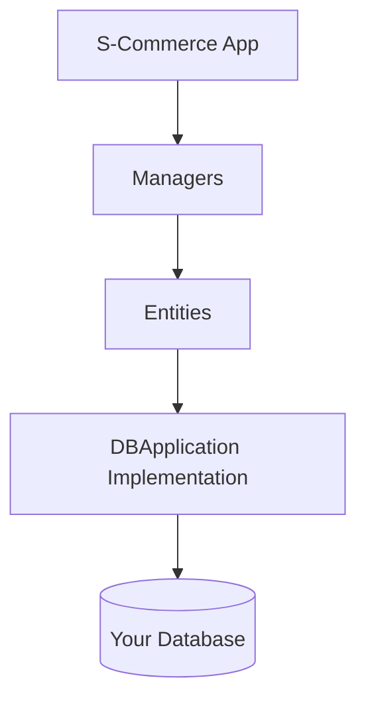

# Database Integration Guide

This guide explains how to implement database persistence for S-Commerce. The library uses a contract-based approach, allowing you to use any database system.

## Table of Contents

- [Overview](#overview)
- [Database Contract System](#database-contract-system)
- [Form Objects Pattern](#form-objects-pattern)
- [Implementation Requirements](#implementation-requirements)
- [Database Method Categories](#database-method-categories)
- [PostgreSQL Sample Analysis](#postgresql-sample-analysis)
- [Implementation Guide](#implementation-guide)
- [Best Practices](#best-practices)
- [Common Patterns](#common-patterns)

## Overview

### Database Abstraction Layer

S-Commerce doesn't enforce a specific database. Instead, it defines contracts (interfaces) that your database layer must implement.

**Key Concept:** Implement the `DBApplication` interface and all its sub-interfaces to provide complete database functionality.

**Benefits:**
- Use any database: PostgreSQL, MySQL, MongoDB, Cassandra, etc.
- Switch databases without changing business logic
- Optimize for your specific use case
- Mix multiple databases if needed

### Architecture



**Flow:**
1. Managers and entities call methods on DB contracts
2. Your DBApplication implementation translates to database queries
3. Results are populated into form objects
4. Forms cache data to minimize queries

## Database Contract System

### DBApplication Interface

The root contract that aggregates all database functionality:

**Composition:**
```
DBApplication[AccountID] interface {
    // Manager-level contracts
    DBUserAccountManager
    DBUserShoppingCartManager
    DBUserOrderManager
    DBUserPaymentMethodManager
    DBUserAddressManager
    DBUserReviewManager
    DBUserRoleManager
    DBProductManager
    DBCountryManager
    DBPaymentTypeManager
    DBShippingMethodManager
    DBOrderStatusManager
    
    // Entity-level contracts
    DBUserAccount
    DBUserShoppingCart
    DBUserShoppingCartItem
    DBUserOrder
    DBUserPaymentMethod
    DBUserAddress
    DBUserRole
    DBUserReview
    DBProductCategory
    DBProduct
    DBProductItem
    DBCountry
    DBPaymentType
    DBShippingMethod
    DBOrderStatus
}
```

**Single Implementation:** Your database struct implements all these interfaces in one place.

### Manager-Level Contracts

Handle collection operations (CRUD on multiple entities):

**Examples:**
- `DBUserAccountManager`: Create account, list accounts, delete all accounts
- `DBProductManager`: Create categories, search products, list items

**Characteristics:**
- Work with lists and collections
- Include initialization (schema creation)
- Handle bulk operations

### Entity-Level Contracts

Handle individual entity operations (properties, relationships):

**Examples:**
- `DBUserAccount`: Get/set first name, manage addresses, wallet operations
- `DBProduct`: Get/set description, manage product items

**Characteristics:**
- Work with single entities
- Property getters and setters
- Relationship navigation
- Calculations and aggregations

## Form Objects Pattern

### Purpose

Form objects serve two critical purposes:

1. **Data Transfer:** Move data between database and application
2. **Caching:** Store recently-accessed data to reduce queries

### Structure

Every entity has a corresponding form struct:

**Pattern:**
```
FormName[AccountID] struct {
    ID       AccountID    // Required identifier
    Property1 *Type1      // Optional field (pointer)
    Property2 *Type2      // Optional field (pointer)
    ...
}
```

**Key Characteristics:**
- ID field is always present and non-pointer
- All other fields are pointers (optional)
- Pointer nil means "not loaded" or "invalidated"

### Usage in Database Methods

**Population Pattern:**

Database methods receive form pointer and populate requested fields:

```
Method signature:
GetUserAccountFirstName(ctx, form *UserAccountForm, id AccountID) (string, error)

Implementation:
1. Query database for first name
2. Store result in form.FirstName = &result
3. Return result and error
```

**Benefits:**
- Caller gets immediate result
- Form is populated for future reference
- Entity can cache the value

### Cache Invalidation

When a property changes, related cache fields are invalidated:

**Example:** Updating first name invalidates LastUpdatedAt cache

```
SetUserAccountFirstName(...):
1. Update database
2. Set form.FirstName = &newValue
3. Set form.LastUpdatedAt = nil (invalidate)
```

**Strategy:** Invalidate any field that might change as a side effect

## Implementation Requirements

### Mandatory Methods

Every method in every DB* interface must be implemented:

- No optional methods
- Partial implementation won't work
- Compilation fails if any method missing

### Transaction Handling

**Recommendation:** Wrap operations in database transactions:

**When to Use Transactions:**
- Multi-step operations
- Consistency-critical updates
- Cascade operations

**Example Scenarios:**
- Creating order from cart (multiple inserts)
- Transferring currency (two account updates)
- Setting default address (update old default, set new)

### Error Handling

**Return Meaningful Errors:**

- Database connection errors
- Constraint violations (unique, foreign key)
- Not found errors
- Validation errors

**Best Practice:** Wrap errors with context using error wrapping

### Form Population Rules

**Always Populate Form:**

Even if you're returning the value directly, populate the form:

```
GetProperty(ctx, form, id):
1. Query database
2. result := queryResult
3. form.Property = &result  // Populate form
4. return result, nil        // Return value
```

**Why:** Caller may use form for caching

**Optional Fields:** Only populate fields you actually queried

## Database Method Categories

### Create Operations (New*)

**Pattern:** Create entity, return ID, populate form

**Signature Example:**
```
NewUserAccount(ctx, token, password, form) (AccountID, error)
```

**Implementation Steps:**
1. Validate inputs
2. Generate or insert with auto-increment ID
3. Insert into database
4. Populate form with created data
5. Return ID

**Form Population:** Populate all fields you have values for

---

### Read Operations (Get*)

**Single Entity:**
```
GetUserAccount(ctx, token, form) (AccountID, error)
```

**Steps:**
1. Query database by token
2. Populate form with all available data
3. Return ID

**List Entities:**
```
GetUserAccounts(ctx, ids []AccountID, forms []*Form, skip, limit, order) ([]AccountID, []*Form, error)
```

**Steps:**
1. Query database with pagination
2. Append results to ids slice
3. Create form for each entity
4. Append forms to forms slice
5. Return populated slices

**Pagination:**
- skip: Offset into result set
- limit: Maximum results (use GetSafeLimit to cap at 500)
- queueOrder: "asc" or "desc"

---

### Update Operations (Set*)

**Pattern:** Update property, update form, invalidate related fields

**Signature Example:**
```
SetUserAccountFirstName(ctx, form, id, name) error
```

**Steps:**
1. Update database
2. Update form.FirstName = &name
3. Invalidate related fields (e.g., form.LastUpdatedAt = nil)

**Invalidation Strategy:**
- Invalidate fields that might change
- Keep updated field cached
- Balance freshness vs performance

---

### Delete Operations (Remove*)

**Single Entity:**
```
RemoveUserAccount(ctx, id) error
```

**All Entities:**
```
RemoveAllUserAccounts(ctx) error
```

**Considerations:**
- Handle cascade deletes
- Foreign key constraints
- Orphan prevention
- Soft vs hard deletes

---

### Search Operations (SearchFor*)

**Pattern:** Find entities by text, apply filters, return results

**Signature Example:**
```
SearchForProducts(ctx, searchText, deepSearch, products, forms, skip, limit, order, categoryID) ([]uint64, []*Form, error)
```

**Parameters:**
- searchText: What to search for
- deepSearch: Whether to search recursively (categories)
- filters: Optional category, product constraints
- Pagination: skip, limit, order

**Implementation:**
- Use LIKE, full-text search, or search engine
- Apply filters with WHERE clauses
- Return matching IDs and populated forms

---

### Calculation Operations (Calculate*)

**Pattern:** Aggregate or compute values

**Examples:**
```
CalculateUserAccountTotalDepts(ctx, form, id) (float64, error)
CalculateProductItemAverageRating(ctx, form, id) (float64, error)
```

**Implementation:**
- Use SQL aggregates (SUM, AVG, COUNT)
- Or fetch data and compute in code
- Cache result in form if beneficial

---

### Relationship Operations

**Pattern:** Navigate relationships, return related entity

**Examples:**
```
GetUserAccountRole(ctx, form, id, roleForm) (uint64, error)
GetProductItemProduct(ctx, form, id, productForm) (uint64, error)
```

**Steps:**
1. Query relationship (foreign key)
2. Populate both forms (entity and related)
3. Return related entity ID

---

### Initialization (Init*Manager)

**Pattern:** Create database schema, insert defaults

**Example:**
```
InitUserAccountManager(ctx) error
```

**Implementation:**
1. Create tables/collections
2. Create indexes
3. Insert default data (if any)
4. Set up constraints

**Note:** Should be idempotent (safe to call multiple times)

## PostgreSQL Sample Analysis

### Sample Structure

The library includes a PostgreSQL reference implementation in `db_samples/postgresql/`.

**Files:**
- `db.go`: Main database struct and connection
- `user_*.go`: User-related implementations
- `product_*.go`: Product-related implementations
- `order_*.go`: Order-related implementations
- `error.go`: Error types

### Key Patterns

**Database Struct:**
```
PostgreDatabase struct {
    PgxPool   *pgxpool.Pool       // Connection pool
    TxOptions pgx.TxOptions        // Transaction settings
}
```

**Transaction Pattern:**
```
Start transaction
Execute operations
Populate forms
Commit or rollback
Return results
```

**Query Pattern:**
- Use prepared statements or parameterized queries
- Protect against SQL injection
- Handle NULL values properly
- Map to form objects

### Table Design

**Typical Table Structure:**
- Primary key (auto-increment or generated)
- Foreign keys for relationships
- Indexes on frequently queried fields
- Unique constraints where needed

**Example: User Account Table**
```
Columns:
- id: Primary key
- token: Unique username/email
- password: Hashed password
- first_name, last_name: Personal info
- role_id: Foreign key to roles
- wallet_currency: Decimal
- is_active, is_super_user: Booleans
- created_at, updated_at: Timestamps
```

## Implementation Guide

### Step 1: Define Database Schema

Design your tables/collections based on entity requirements:

**For Each Entity:**
1. Identify properties (from form objects)
2. Determine relationships (foreign keys)
3. Add indexes for performance
4. Define constraints

**Tools:**
- ER diagrams for visualization
- Migration tools for schema management
- Version control for schema changes

### Step 2: Create Database Struct

**Structure:**
```
YourDatabase struct {
    // Connection pool or client
    // Configuration
    // Transaction options
}
```

**Initialization Function:**
```
NewYourDatabase(ctx, config) (*YourDatabase, error)
- Establish connection
- Set up pool
- Configure options
- Return instance
```

### Step 3: Implement Each Interface

**Systematic Approach:**

1. Start with reference data (Country, PaymentType, etc.)
2. Move to user management
3. Then products and catalog
4. Finally orders and reviews

**For Each Method:**
1. Write method signature
2. Implement database operation
3. Populate form objects
4. Handle errors
5. Test thoroughly

### Step 4: Handle Form Population

**Consistency:**
- Always populate forms
- Set nil for unqueried fields
- Update affected fields on writes

**Performance:**
- Populate only necessary fields
- Use joins to reduce queries
- Cache wisely

### Step 5: Implement Transactions

**Strategy:**
```
Method requiring transaction:
1. Begin transaction
2. Execute operations
3. On error: rollback, return error
4. On success: commit, return result
```

**Nested Transactions:** Handle with savepoints if database supports

### Step 6: Add Connection Pooling

**Configuration:**
- Minimum pool size
- Maximum pool size
- Connection timeout
- Idle timeout

**Best Practice:** Use database driver's built-in pooling

### Step 7: Create Indexes

**Index Strategy:**
- Primary keys (automatic)
- Foreign keys (performance)
- Frequently searched fields (name, SKU)
- Unique constraints (token, email)

**Avoid:** Over-indexing (slows writes)

### Step 8: Test Implementation

**Test Types:**
1. Unit tests for each method
2. Integration tests with real database
3. Transaction rollback tests
4. Concurrent access tests
5. Error handling tests

## Best Practices

### Connection Management

**Pool Configuration:**
- Set reasonable limits based on load
- Monitor pool usage
- Handle connection errors gracefully
- Implement retry logic

**Connection String Security:**
- Use environment variables
- Don't commit credentials
- Use connection string encryption

### Query Optimization

**Performance:**
- Use prepared statements
- Avoid N+1 queries
- Use joins instead of loops
- Index frequently-queried fields

**Monitoring:**
- Log slow queries
- Profile query performance
- Use EXPLAIN to understand execution

### Data Integrity

**Constraints:**
- Foreign key constraints
- Unique constraints
- Check constraints
- Not null constraints

**Validation:**
- Validate in database and application
- Sanitize inputs
- Prevent injection attacks

### Cascade Deletes

**Strategy:**
- Define cascade behavior in schema
- Or implement in application
- Be explicit about orphan handling

**Example:** Deleting user should delete addresses, payment methods, carts

### Default Values

**Handling Defaults:**
- One default address per user
- One default payment method per user
- Update old default when setting new

**Implementation:** Use transaction to ensure consistency

### Error Messages

**Meaningful Errors:**
- Distinguish between not found, constraint violation, connection error
- Provide context (which entity, what operation)
- Log detailed errors, return user-friendly messages

## Common Patterns

### Relationship Handling

**Foreign Key Pattern:**
```
Entity has relationship field (uint64 ID)
Form has optional pointer to ID
Database stores foreign key
Query returns ID, populates form
```

**Optional Relationships:**
```
Use *uint64 for optional foreign keys
NULL in database = nil pointer in code
```

### Pagination Pattern

**Implementation:**
```
SQL:
SELECT * FROM table
ORDER BY column [ASC|DESC]
LIMIT limit OFFSET skip

MongoDB:
collection.find().skip(skip).limit(limit).sort(order)
```

**Limit Cap:**
```
safeLimitValue := GetSafeLimit(requestedLimit)
// Caps at 500 to prevent excessive results
```

### Session/Token Pattern

**Shopping Cart Sessions:**
- Unique session text per cart
- Used to find cart before authentication
- Index session_text field

**Account Tokens:**
- Unique username or email
- Used for authentication
- Index token field

### Default Resource Pattern

**Setting Default:**
```
BEGIN TRANSACTION
UPDATE table SET is_default = false WHERE user_id = ?
UPDATE table SET is_default = true WHERE id = ?
COMMIT
```

**Getting Default:**
```
SELECT * FROM table WHERE user_id = ? AND is_default = true
```

### Search Pattern

**Text Search:**
```
SQL:
WHERE name LIKE '%search%' OR description LIKE '%search%'

PostgreSQL Full-Text:
WHERE to_tsvector(name || ' ' || description) @@ to_tsquery(search)

MongoDB:
{ $text: { $search: searchText } }
```

**Deep Category Search:**
```
1. Find category and all descendants
2. Search products in those categories
3. Use recursive CTE or multiple queries
```

## Testing Strategy

### Database Integration Tests

**Setup:**
1. Create test database
2. Run schema initialization
3. Insert test data
4. Run tests
5. Clean up

**Test Isolation:**
- Use transactions that rollback
- Or drop/recreate database
- Ensure tests don't interfere

### Test Data Management

**Fixtures:**
- Create reusable test data
- Use factories for entities
- Keep tests independent

**Cleanup:**
- Always clean up test data
- Don't rely on test order
- Use unique identifiers

### Concurrent Access Testing

**Scenarios:**
- Multiple creates simultaneously
- Concurrent updates to same entity
- Default resource race conditions
- Transaction deadlocks

**Tools:**
- Run operations in goroutines
- Use synchronization to coordinate
- Verify consistency after operations

## Alternative Databases

### MongoDB Example

**Approach:**
- Documents instead of tables
- Embed relationships or use references
- Use MongoDB IDs or custom IDs

**Considerations:**
- No joins (denormalize or multi-query)
- Different transaction semantics
- Flexible schema (validate in code)

### MySQL Example

**Similarities to PostgreSQL:**
- Relational model
- SQL queries
- Similar patterns

**Differences:**
- Some syntax variations
- Different connection drivers
- Transaction isolation differences

### Multi-Database Architecture

**Scenario:** Use different databases for different domains

**Example:**
- PostgreSQL for transactional data (orders, accounts)
- MongoDB for product catalog (flexible attributes)
- Redis for session data (carts)

**Implementation:** DBApplication can delegate to multiple backends

## Next Steps

- See complete contract definitions: [Contracts Reference](contracts.md)
- Understand manager responsibilities: [Managers](managers.md)
- Learn entity behavior: [Entities](entities.md)
- Implement file storage: [File Storage](file-storage.md)
- Explore extension patterns: [Extending Builtin Objects](extending-builtin-objects.md)
