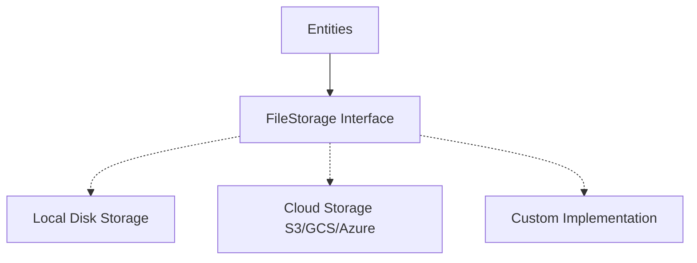

# File Storage Guide

This guide explains the file storage system in S-Commerce and how to implement storage backends for images and other files.

## Table of Contents

- [Overview](#overview)
- [File Storage Contract System](#file-storage-contract-system)
- [Token System](#token-system)
- [Builtin Implementations](#builtin-implementations)
- [Integration Points](#integration-points)
- [Custom Implementation Guide](#custom-implementation-guide)
- [File Workflows](#file-workflows)
- [Best Practices](#best-practices)
- [Error Handling](#error-handling)

## Overview

### Purpose

S-Commerce needs to store files for:
- User profile images
- Product images  
- Product item images
- Future: Order receipts, invoices, attachments

### Abstraction Layer

The library doesn't enforce a specific storage backend. Instead, it defines the `FileStorage` interface that your storage implementation must satisfy.

**Benefits:**
- Use local disk, cloud storage (S3, GCS, Azure), or hybrid
- Switch storage without changing business logic
- Optimize for your infrastructure
- Handle file operations consistently

### Architecture



**Flow:**
1. Entities call FileStorage methods
2. Your implementation handles actual storage
3. Files identified by string tokens
4. Tokens stored in database, files in storage

## File Storage Contract System

### FileStorage Interface

The main contract for file storage operations:

**Methods:**

| Method | Purpose | Parameters | Returns |
|--------|---------|------------|---------|
| Connect | Establish connection to storage | ctx | error |
| Open | Open existing file for read/write | ctx, token | FileIO, error |
| Create | Create new file for writing | ctx, token | FileIO, error |
| Exists | Check if file exists | ctx, token | bool, error |
| Delete | Remove single file | ctx, token | error |
| DeleteAll | Remove multiple files/directory | ctx, path | error |
| Close | Cleanup and release resources | ctx | error |

**Lifecycle:**
1. Connect: Called during app initialization
2. Open/Create/Delete: Called during operations
3. Close: Called during app shutdown

---

### FileIO Interface

Represents an open file handle returned by Open and Create:

**Composition:**
```
FileIO interface {
    FileReader    // Read + GetToken
    FileWriter    // Write + GetToken
    FileCloser    // Close + GetToken
    io.Seeker     // Seek
}
```

**Complete Interface:**
- `Read(p []byte) (n int, err error)` - Read data from file
- `Write(p []byte) (n int, err error)` - Write data to file
- `Seek(offset int64, whence int) (int64, error)` - Move file pointer
- `Close() error` - Close file handle
- `GetToken(ctx) (string, error)` - Get file identifier

**Usage Patterns:**
- **FileReader**: Read images for display/download
- **FileWriter**: Write uploaded content
- **Seeker**: Partial file operations, resumable uploads
- **FileCloser**: Always close after use

---

### Related Interfaces

**FileReader:**
```
FileReader interface {
    io.Reader
    FileIdentifier
}
```

**FileWriter:**
```
FileWriter interface {
    io.Writer
    FileIdentifier
}
```

**FileCloser:**
```
FileCloser interface {
    io.Closer
    FileIdentifier
}
```

**FileReadCloser:**
```
FileReadCloser interface {
    FileReader
    FileCloser
}
```

**FileWriteCloser:**
```
FileWriteCloser interface {
    FileWriter
    FileCloser
}
```

**FileIdentifier:**
```
FileIdentifier interface {
    GetToken(ctx) (string, error)
}
```

## Token System

### What is a Token?

A **token** is a unique string identifier for a file.

**Characteristics:**
- Unique across all files in the storage
- Used to retrieve the file later
- Stored in database alongside entity
- Format depends on storage implementation

### Token Strategies

**Local Disk:**
- Token = filename
- Example: "user-123-profile.jpg"
- Stored in configured directory

**Cloud Storage:**
- Token = object key/path
- Example: "users/123/profile.jpg"
- S3: bucket + key
- GCS: bucket + object name

**Custom:**
- UUID or hash-based
- Example: "a7f3c2d1-8e9b-4f5a-a1c2-d3e4f5a6b7c8"
- Maps to actual storage location

### Token Generation

**Strategies:**

1. **Sequential:** user-1.jpg, user-2.jpg, etc.
   - Simple but predictable
   - Potential security concern

2. **UUID:** Random UUID for each file
   - Unpredictable
   - Collision-resistant
   - Longer tokens

3. **Hash-based:** Hash of content + timestamp
   - Content-addressable
   - Deduplication possible
   - Complex implementation

4. **Structured:** users/123/profile/1.jpg
   - Organized storage
   - Easy to browse
   - Consider permissions

### Token Storage

**In Database:**
- User profile images: array of tokens in user_accounts table
- Product images: array of tokens in products table
- Product item images: array of tokens in product_items table

**Example:**
```
user_accounts table:
- id: 123
- profile_images: ["token1.jpg", "token2.jpg"]

Storage system:
- Files at: /storage/token1.jpg, /storage/token2.jpg
```

## Builtin Implementations

### OSFileIO

Wraps `os.File` for standard filesystem operations:

**Structure:**
```
OSFileIO struct {
    File  *os.File    // Standard Go file handle
    Token string      // File identifier
}
```

**Methods:**
- Read: Delegates to os.File.Read
- Write: Delegates to os.File.Write
- Seek: Delegates to os.File.Seek
- Close: Delegates to os.File.Close
- GetToken: Returns stored token

**Use Case:** Local disk file operations

---

### BytesFileIO

Wraps `bytes.Reader` for in-memory operations:

**Structure:**
```
BytesFileIO struct {
    File  *bytes.Reader    // In-memory reader
    Token string           // File identifier
}
```

**Methods:**
- Read: Delegates to bytes.Reader.Read
- Write: No-op (read-only)
- Seek: Delegates to bytes.Reader.Seek
- Close: No-op (no resources to release)
- GetToken: Returns stored token

**Use Case:** 
- Serving static content from memory
- Testing without disk I/O
- Read-only file access

---

### LocalDiskFileStorage

Complete FileStorage implementation for local filesystem:

**Structure:**
```
LocalDiskFileStorage struct {
    Directory string    // Base directory for all files
}
```

**Implementation Details:**

**Create Method:**
```
Steps:
1. Join directory path with token to get full path
2. Call os.Create to create file
3. Return OSFileIO wrapping the file handle
```

**Open Method:**
```
Steps:
1. Join directory path with token
2. Call os.OpenFile with read/write flags
3. Return OSFileIO wrapping the file handle
```

**Exists Method:**
```
Steps:
1. Try to open file
2. If os.ErrNotExist, return false
3. If successful, close and return true
4. Other errors propagated
```

**Delete Method:**
```
Steps:
1. Join directory path with token
2. Call os.Remove
```

**DeleteAll Method:**
```
Steps:
1. Call os.RemoveAll with path
2. Removes directory and all contents
```

**Connect/Close:**
- Connect: No-op (no connection needed)
- Close: No-op (no resources to release)

**Example Usage:**
```
Directory: "./scommerce-files"
Token: "user-123-profile.jpg"
Full path: "./scommerce-files/user-123-profile.jpg"
```

**Setup:**
```
Steps:
1. Create directory: mkdir scommerce-files
2. Create storage: NewLocalDiskFileStorage("./scommerce-files")
3. Pass to AppConfig.FileStorage
```

## Integration Points

### Where Files are Used

**User Profile Images:**
- Multiple images per user
- Methods: GetProfileImages, SetProfileImages
- Stored as: array of tokens in database
- Typical use: Avatar, photo gallery

**Product Images:**
- Multiple images per product
- Methods: GetImages, SetImages
- Stored as: array of tokens in database
- Typical use: Product photos from different angles

**Product Item Images:**
- Multiple images per product item
- Methods: GetImages, SetImages
- Stored as: array of tokens in database
- Typical use: Variant-specific images (color, style)

**Future Extensions:**
- Order receipts/invoices
- User-uploaded documents
- Product manuals/datasheets

### Storage Pattern

**Consistent Approach Across All File Types:**

1. Entity receives array of FileReader
2. Entity calls FileStorage.Create for each file
3. FileStorage returns FileIO with token
4. Entity writes data to FileIO
5. Entity closes FileIO
6. Entity stores tokens in database
7. To retrieve: Entity loads tokens from database
8. Entity calls FileStorage.Open for each token
9. Returns array of FileReadCloser to caller

**Benefits:**
- Uniform handling of all file types
- Database stores lightweight tokens
- Actual files in dedicated storage
- Easy to migrate storage backends

## Custom Implementation Guide

### Creating Cloud Storage Integration

Let's walk through implementing S3-compatible storage:

**Step 1: Define Structure**
```
S3FileStorage struct:
- S3 client (AWS SDK)
- Bucket name
- Region configuration
- Optional: prefix for all keys
```

**Step 2: Implement Connect**
```
Steps:
1. Initialize AWS S3 client
2. Configure credentials (IAM, access keys, etc.)
3. Verify bucket exists
4. Set up any required configuration
```

**Step 3: Implement Create**
```
Steps:
1. Generate unique token (UUID or structured key)
2. Create S3FileIO for writing
3. Return FileIO instance
4. Actual upload happens when Write is called
```

**Step 4: Implement Open**
```
Steps:
1. Verify object exists in S3
2. Create S3FileIO for reading
3. Return FileIO instance
```

**Step 5: Implement Exists**
```
Steps:
1. Call HeadObject on S3 client
2. If NoSuchKey error, return false
3. If successful, return true
```

**Step 6: Implement Delete**
```
Steps:
1. Call DeleteObject with bucket and key
2. Handle errors appropriately
```

**Step 7: Implement DeleteAll**
```
Steps:
1. List objects with prefix
2. Delete all matching objects
3. Handle pagination if many objects
```

**Step 8: Implement Close**
```
Steps:
1. Close S3 client if needed
2. Clean up any resources
```

**Step 9: Create S3FileIO**
```
S3FileIO struct:
- S3 client
- Bucket name
- Object key (token)
- Buffer for read/write
- Position for seeking

Methods:
- Read: Download from S3, buffer data
- Write: Buffer writes, upload on close
- Seek: Track position in buffer
- Close: Flush writes to S3
- GetToken: Return object key
```

### Example: Google Cloud Storage

Similar approach to S3:

**Differences:**
- Use GCS client library
- Bucket + object name instead of bucket + key
- Different authentication (service account)
- Similar API patterns

### Example: Azure Blob Storage

**Approach:**
- Use Azure SDK
- Storage account + container + blob
- SAS tokens or key authentication
- Similar patterns to S3

### Hybrid Storage Example

**Scenario:** Local for thumbnails, cloud for originals

**Approach:**
```
HybridFileStorage struct:
- Local storage for small files
- Cloud storage for large files
- Size threshold

Implementation:
- Check file size
- Route to appropriate backend
- Prefix token to indicate storage type
```

## File Workflows

### User Profile Image Upload

**Complete Flow:**

1. **Client Uploads Image**
   - User submits image file
   - Application receives image data

2. **Create FileReader**
   - Wrap image data in FileReader
   - Could be from HTTP request body, file upload, etc.

3. **Call SetProfileImages**
   - Pass array of FileReaders to account.SetProfileImages
   - Can upload multiple images at once

4. **Entity Implementation**
   - For each FileReader:
     - Generate token (UUID, hash, etc.)
     - Call FileStorage.Create(ctx, token)
     - FileStorage returns FileIO
     - Copy data from FileReader to FileIO
     - Close FileIO (triggers upload in cloud storage)
     - Collect token

5. **Store Tokens**
   - Array of tokens passed to database
   - Database updates user_accounts.profile_images

6. **Cleanup**
   - Old tokens (if any) are replaced
   - Old files should be deleted (implement in SetProfileImages)

**Result:** Images stored, tokens in database

---

### Image Retrieval

**Complete Flow:**

1. **Call GetProfileImages**
   - Application calls account.GetProfileImages()

2. **Entity Implementation**
   - Load tokens from database (via form or query)
   - For each token:
     - Call FileStorage.Open(ctx, token)
     - FileStorage returns FileIO
     - Add to result array

3. **Return FileReadClosers**
   - Array of FileReadCloser returned to application

4. **Application Uses Images**
   - Read data from each FileReadCloser
   - Stream to HTTP response, save locally, process, etc.
   - **Important:** Close each FileReadCloser when done

5. **Cleanup**
   - Closing FileReadCloser releases resources
   - Cloud storage: closes connections
   - Local storage: closes file handles

**Result:** Images retrieved and used

---

### Product Image Upload (Similar Pattern)

1. Create product or product item
2. Prepare image FileReaders
3. Call SetImages with readers
4. Images uploaded, tokens stored
5. Images retrievable via GetImages

## Best Practices

### Always Close Files

**Critical:** Always close FileIO, FileReadCloser, FileWriteCloser

**Pattern:**
```
Steps:
1. Call Open or Create
2. Defer Close immediately
3. Use file
4. Close executes on function exit
```

**Why:** Prevents resource leaks (file handles, network connections)

---

### Buffered I/O for Large Files

**For Large Files:**
- Use buffered reading/writing
- Don't load entire file into memory
- Stream data in chunks

**Implementation:**
```
Buffer size: 64KB or larger
Read in loop until EOF
Write in chunks
```

---

### Token Collision Prevention

**Strategies:**

1. **UUID Tokens:** 
   - Virtually impossible to collide
   - No checking needed

2. **Generated Names:**
   - Check Exists before Create
   - Retry with new token if exists
   - Limit retries to prevent infinite loop

3. **Sequential:**
   - Use database sequence or auto-increment
   - Guaranteed unique
   - Less random

---

### File Size Limits

**Considerations:**
- Set maximum file size for uploads
- Prevent storage exhaustion
- Validate before upload
- Return clear errors for oversized files

**Example Limits:**
- Profile images: 5 MB
- Product images: 10 MB
- Documents: 25 MB

---

### Error Recovery

**Upload Failures:**
- Don't leave partial files
- Clean up on error
- Retry transient errors
- Log permanent failures

**Delete Failures:**
- Log but don't fail operation
- Implement cleanup job
- Track orphaned files

---

### Security

**Access Control:**
- Validate user permissions before upload
- Check ownership before delete
- Prevent path traversal attacks
- Sanitize filenames/tokens

**Content Validation:**
- Verify file type (magic bytes, not extension)
- Scan for malware if high security needed
- Prevent executable uploads
- Strip metadata if privacy concern

---

### Performance

**Optimization:**
- Use CDN for serving images
- Generate thumbnails asynchronously
- Cache frequently accessed files
- Use appropriate storage class (S3 tiers)

**Monitoring:**
- Track storage usage
- Monitor upload/download times
- Alert on errors
- Measure cost

## Error Handling

### File Not Found

**Scenario:** Open called with non-existent token

**Handling:**
- Return error indicating file not found
- Don't expose internal paths
- Application can show "Image unavailable"
- Consider fallback image

---

### Storage Backend Unavailable

**Scenario:** Cloud storage down, disk full, network error

**Handling:**
- Return error with context
- Implement retry logic with exponential backoff
- Fallback to cached version if available
- Degrade gracefully (show placeholder)

---

### Token Conflicts

**Scenario:** Create called with existing token

**Handling:**
- Check Exists first
- Generate new token if conflict
- Or overwrite (be explicit about this)
- Document behavior

---

### Permission Issues

**Scenario:** No write access to disk, no cloud permissions

**Handling:**
- Check permissions during Connect
- Return clear error messages
- Fail fast during initialization
- Document required permissions

---

### Partial Uploads

**Scenario:** Upload interrupted mid-transfer

**Handling:**
- Use multipart upload for large files (S3)
- Implement resumable uploads
- Clean up partial data on error
- Return error to retry

---

### Disk Full

**Scenario:** Local storage runs out of space

**Handling:**
- Check available space before large uploads
- Set up monitoring and alerts
- Implement quotas per user
- Return clear error

## Testing Strategies

### Mock Implementation

**For Unit Tests:**
```
MockFileStorage struct:
- In-memory map of token -> data
- Implement all FileStorage methods
- No actual I/O
- Predictable behavior
```

**Benefits:**
- Fast tests
- No external dependencies
- Full control over behavior
- Test error scenarios

---

### Temporary Directory Testing

**For Integration Tests:**
```
Steps:
1. Create temp directory
2. Create LocalDiskFileStorage with temp dir
3. Run tests
4. Clean up temp directory
```

**Benefits:**
- Real file operations
- Isolated from production
- Automatic cleanup
- Tests actual behavior

---

### Cloud Storage Testing

**For Production-Like Tests:**
```
Setup:
1. Use test bucket/container
2. Use test credentials
3. Run full integration tests
4. Clean up test data

Considerations:
- Cost (minimize with small files)
- Network dependency
- Slower than local tests
```

## Next Steps

- Understand file usage in entities: [Entities](entities.md)
- Implement database layer: [Database Integration](database-integration.md)
- See file operations in action: [Examples](examples.md)
- Learn about customization: [Extending Builtin Objects](extending-builtin-objects.md)
